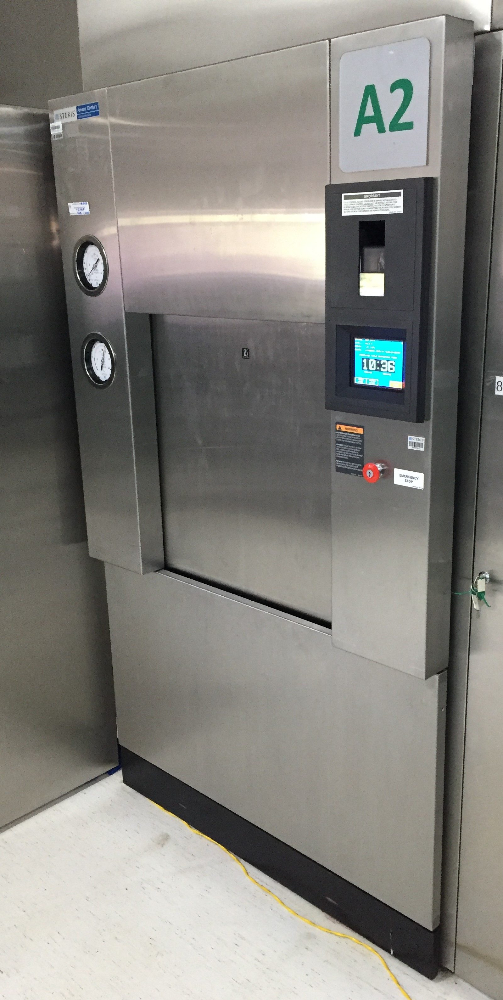

# 📋 Padrões de SEO e Segurança — Walida

**Versão:** 1.0  
**Última atualização:** 18 de setembro de 2026  
**Responsável:** Equipe de Qualificação Térmica

---

## 🎯 Objetivo

Este documento estabelece **padrões obrigatórios** para manter e atualizar o site da Walida, garantindo:
- ✅ **SEO otimizado** para aparecer nos buscadores
- ✅ **Segurança reforçada** contra vulnerabilidades
- ✅ **Acessibilidade** para todos os usuários
- ✅ **Conformidade regulatória** (LGPD, GDPR, RDC 658, ISO 17025)

---

## 📝 Checklist de Manutenção

### Antes de fazer qualquer alteração no site:

- [ ] Editar em um branch local
- [ ] Testar em navegadores (Chrome, Firefox, Safari, Edge)
- [ ] Verificar responsividade (mobile, tablet, desktop)
- [ ] Validar HTML: https://validator.w3.org/
- [ ] Testar velocidade: https://pagespeed.web.dev/

### Depois de fazer alterações:

- [ ] Atualizar `sitemap.xml` com `lastmod: 2026-09-18` (data atual)
- [ ] Atualizar `sitemap-images.xml` se houver novas imagens
- [ ] Verificar links internos quebrados
- [ ] Fazer commit com mensagem descritiva
- [ ] Fazer push para GitHub
- [ ] Aguardar ~5 minutos para GitHub Pages processar
- [ ] Testar o site ao vivo: https://walidanordeste-create.github.io/site-walida/

---

## 🖼️ Padrões de Imagens

### Otimização:
- **Formato:** JPG (fotografias) ou PNG (logos/ícones)
- **Tamanho máximo:** 500 KB por imagem
- **Dimensões:** 1280×720px (padrão web) ou 2560×1440px (high-res)
- **Ferramenta:** TinyPNG, ImageOptim, ou similar

### Alt Text (obrigatório):
Toda imagem `` deve ter:
```html

```

### Sitemap de Imagens:
- Adicionar todas as imagens em `sitemap-images.xml`
- Incluir: `<image:title>` e `<image:caption>`
- Atualizar quando adicionar novas imagens

---

## 🔒 Padrões de Segurança

### Headers Obrigatórios (no `<head>`):
```html
<meta http-equiv="X-UA-Compatible" content="IE=edge">
<meta http-equiv="Content-Security-Policy" 
      content="default-src 'self' https:; ...">
<meta name="referrer" content="strict-origin-when-cross-origin">
```

### HTTPS:
- ✅ **Obrigatório** para todos os links externos
- ✅ Usar `https://` sempre
- ❌ Nunca usar `http://`

### Dados Sensíveis:
- ❌ **Nunca** adicionar senhas, tokens ou chaves de API
- ❌ **Nunca** adicionar dados de pacientes ou clientes reais
- ✅ Usar dados anônimos ou "Cliente A", "Estudo 12"

### Formulários:
- ✅ Usar `method="POST"` (não GET)
- ✅ Validar entrada do cliente
- ✅ Sanitizar dados antes de processar
- ✅ Usar HTTPS para formulários

---

## 📊 Padrões de SEO

### Meta Tags Obrigatórias:
```html
<title>Página — Walida</title>
<meta name="description" content="Descrição em 160 caracteres">
<meta property="og:title" content="Título">
<meta property="og:description" content="Descrição">
<meta property="og:image" content="URL da imagem">
<link rel="canonical" href="URL completa">
```

### Schema.org (JSON-LD):
- ✅ Adicionar `LocalBusiness` na página principal
- ✅ Adicionar `BreadcrumbList` em subpáginas
- ✅ Adicionar `Organization` com informações de contato
- ✅ Validar em: https://schema.org/docs/schemas.html

### Sitemaps:
- ✅ `sitemap.xml` — Páginas principais
- ✅ `sitemap-images.xml` — Todas as imagens
- ✅ Listar em `robots.txt`

### Keywords:
- 🎯 **Primária:** Qualificação Térmica, Validação, Nordeste
- 🎯 **Secundárias:** RDC 658, ISO 17025, ICH, Autoclave, Câmara Climática
- 🎯 **Locais:** Alagoas, Bahia, Ceará, Pernambuco, etc.

---

## 🏗️ Estrutura de Arquivo

```
site-walida/
├── index.html                    ← Página principal (SÓ PÁGINA DINÂMICA)
├── privacy-policy.html           ← Política de Privacidade (LGPD)
├── 404.html                      ← Página de erro customizada
├── sitemap.xml                   ← Mapa do site (páginas)
├── sitemap-images.xml            ← Mapa do site (imagens)
├── robots.txt                    ← Instruções para bots
├── _config.yml                   ← Config GitHub Pages
├── manifest.json                 ← PWA manifest
├── .nojekyll                     ← Desabilita Jekyll
├── README.md                     ← Documentação geral
├── SEO-SECURITY-STANDARDS.md     ← ESTE ARQUIVO
├── logo-walida.png               ← Logo (192×192px)
├── logos/                        ← Logos adicionais
├── foto-*.jpg                    ← Imagens (otimizadas)
└── google368eb4997d929ee5.html  ← Verificação Google
```

---

## 🕐 Cronograma de Tarefas

| Tarefa | Frequência | Responsável | Tempo |
|--------|------------|-------------|-------|
| Verificar links quebrados | Mensal | Dev | 15 min |
| Atualizar sitemap | A cada alteração | Dev | 5 min |
| Revisar Analytics | Mensal | Marketing | 30 min |
| Teste de velocidade | Trimestral | Dev | 20 min |
| Verificação de segurança | Trimestral | Dev | 45 min |
| Atualizar política privacidade | Anual/conforme necessário | Legal | 1h |

---

## 🚀 Como Fazer Deployment

### 1. Localmente:
```bash
cd /home/user/site-walida
git status                    # Ver mudanças
git add .                     # Preparar arquivos
git commit -m "Descrição"     # Fazer commit
git push origin main          # Enviar para GitHub
```

### 2. No GitHub Pages:
- ✅ Aguarde ~5 minutos
- ✅ Verificar em: https://walidanordeste-create.github.io/site-walida/
- ✅ Verificar 404: https://walidanordeste-create.github.io/site-walida/pagina-inexistente

### 3. Registrar no Google:
```
1. Google Search Console: https://search.google.com/search-console/
2. Solicitar indexação do sitemap.xml
3. Aguardar 1-2 semanas
```

---

## 📈 Métricas de Sucesso

- ✅ **Velocidade:** < 2s em 3G
- ✅ **Mobile:** 90+ no Lighthouse
- ✅ **SEO:** 90+ no Lighthouse
- ✅ **Segurança:** 90+ no Lighthouse
- ✅ **Indexação:** Aparecer no Google em 2-4 semanas

### Ferramentas para medir:
- **PageSpeed:** https://pagespeed.web.dev/
- **Lighthouse:** Integrado no Chrome DevTools (F12)
- **Google Search Console:** https://search.google.com/search-console/
- **Google Analytics:** https://analytics.google.com/
- **SEO Checker:** https://www.seobility.net/

---

## 🆘 Troubleshooting

| Problema | Causa | Solução |
|----------|-------|---------|
| Site não atualiza | Cache do navegador | Limpar cache (Ctrl+Shift+Del) |
| 404 em subpágina | Arquivo não existe | Verificar sitemap e estrutura |
| Não aparece no Google | Sitemap não indexado | Submeter em Search Console |
| Imagens lentas | Arquivo muito grande | Otimizar com TinyPNG |
| CSP bloqueando script | Header CSP restritivo | Adicionar origem em `<meta>` |

---

## 📞 Contato e Dúvidas

- **Suporte técnico:** Abrir issue no GitHub
- **SEO/Marketing:** Revisar Google Search Console
- **Segurança:** Consultar OWASP Top 10

---

## ✅ Conformidade Regulatória

Este site está em conformidade com:

| Norma/Lei | Implementação | Status |
|-----------|---------------|--------|
| **LGPD** | Política de Privacidade + GDPR consent | ✅ Completo |
| **GDPR** | Privacy Policy + Transparent consent | ✅ Completo |
| **RDC 658** | Documentação de conformidade | ✅ Completo |
| **ISO 17025** | Competência de laboratórios | ✅ Completo |
| **WCAG 2.1** | Acessibilidade (Alt text, semântica) | ✅ Parcial |

---

**Documento versão 1.0 — Efetivo desde 18/09/2026**  
**Próxima revisão: 18/09/2027**
